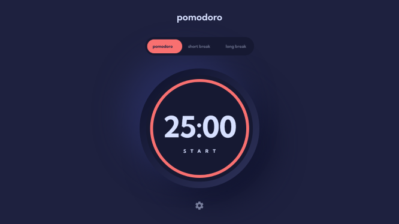

# Frontend Mentor - Pomodoro app solution

This is a solution to the [Pomodoro app challenge on Frontend Mentor](https://www.frontendmentor.io/challenges/pomodoro-app-KBFnycJ6G). Frontend Mentor challenges help you improve your coding skills by building realistic projects. 

## Table of contents

- [Overview](#overview)
  - [The challenge](#the-challenge)
  - [Screenshot](#screenshot)
  - [Links](#links)
- [My process](#my-process)
  - [Built with](#built-with)
  - [What I learned](#what-i-learned)
  - [Continued development](#continued-development)
  - [Useful resources](#useful-resources)
- [Author](#author)
- [Acknowledgments](#acknowledgments)

## Overview

### The challenge

Users should be able to:

- Set a pomodoro timer and short & long break timers
- Customize how long each timer runs for
- See a circular progress bar that updates every minute and represents how far through their timer they are
- Customize the appearance of the app with the ability to set preferences for colors and fonts

### Screenshot

### Links

- Solution URL: [Github Repository](https://github.com/eliasonic/Pomodoro-app)
- Live Site URL: [Pomodoro App](https://elias-pomodoro.netlify.app)

## My process

### Built with

- HTML
- CSS 
- JavaScript

### What I learned

- JavaScript Syntax
- The Document Object Model (DOM) 
- The window object setInterval() method for executing a timer

### Continued development

- I plan to implement JavaScript modules in my future projects.

- I hope to utilize jquery in my next work to attain a more concise code.

### Useful resources

- [Comprehensive JavaScript](https://www.codecademy.com) - This course on Codecademy helped me understand JavaScript, especially the Document Object Model, which is vital for this project. 

## Author

- LinkedIn - [Elias Adjetey](https://www.linkedin.com/in/elias-adjetey-98522686/)
- Github - [@eliasonic](https://github.com/eliasonic)
- Twitter - [@eliasonic](https://twitter.com/eliasonic)

## Acknowledgments

- Special thanks to [AmaliTech](https://amalitech.org) for providing the training and mentorship for this project.

- Credit to [EFTechLab](https://www.youtube.com/watch?v=uHVPAcaW1VQ) for providing insight into the implementation of the progress indicator.

